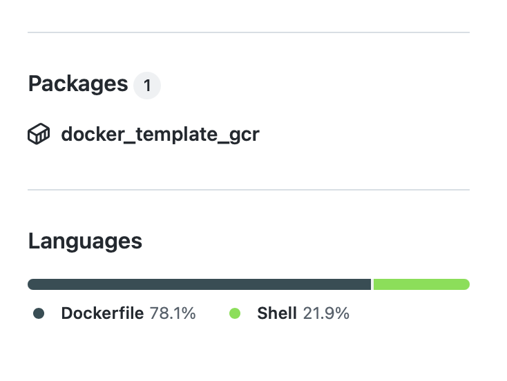

# DOCKER_TEMPLATE_GitHub_Container_Registry


Docker template repository, for automatic container / package generation for GitHub Container Registry.

The package is available in the package setion on the right:

:bangbang: This may only be available as **private**, so just click on **use this template** and use the created package of your own repository.

### Note: Private repositories
To pull private repositories, you have to create a access token first, go to https://docs.github.com/en/authentication/keeping-your-account-and-data-secure/creating-a-personal-access-token:

Save your token to an environment variable:
```
export CR_PAT=YOUR_TOKEN
```

Login to GitHub container registry using:
```
$ echo $CR_PAT | docker login ghcr.io -u USERNAME --password-stdin
> Login Succeeded
```

Then, you can pull / run the image.

